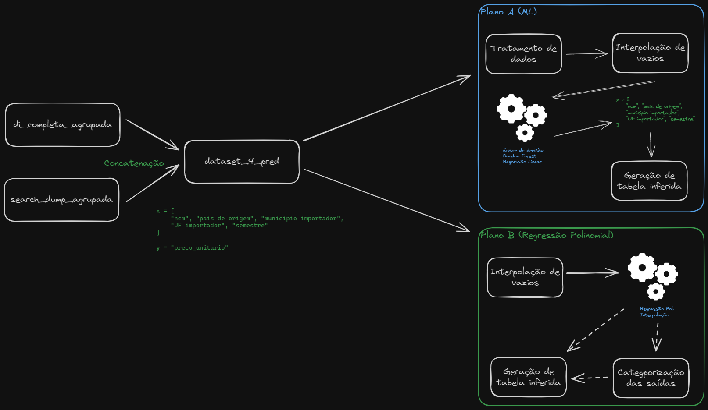

# TPU - Tendência de Preço Unitário


## 📜 Resumo
Esse repositório é dedicado ao desenvolvimento da previsão de tendência do preço unitário dos produtos importados. Nossa principal ideia é a de oferecer para o cliente um entendimento se o preço médio do produto comercializado por ele terá uma alta ou uma baixa no próximo semestre.

### 💻 Abordagens Usadas
A fim de atendermos esse requisito de insight, utilizamos três principais abordagens:
- **1. Determinística Contínua:** A fim de prevermos o preço unitário médio para o próximo semestre;
	- _Para essa abordagem, nós utilizamos tanto algoritmos de árvore quanto a regressão polinomial_

- **2. Determinística Categórica**: Ao invés de acertarmos o preço na vírgula, analisamos o preço em função do tempo e tentamos prever se a maior tendência é de alta, queda ou preço mantido para o futuro;
	- Neste cenário nós utilizamos o algoritmos de árvore categórico e classificamos a saída da regressão polinomial para se encaixar no modelo categórico, portanto, mesmo que essa regressão nos retornasse o número na vírgula, nos baseamos no valor histórico do semestre anterior para categorizar o resultado. Por exemplo, se nosso modelo previu que o preço unitário será de R$2,00 no segundo semestre de 2023 e o preço histórico desse produto era de R$1,99 no primeiro semestre de 2023, nós categorizávamos o resultado como `alta`;



<center>
<p>
<i>
Fluxograma das abordagens listadas nos itens 1 e 2
</i>
</p>
</center>

 
- **3. Probabilística Categórica:** A fim de obtermos melhores resultados, prevemos não só a tendência maior mas quais as probabilidades de cada categoria aparecer;
	- A fim de resolver essa ideia probabilística, nós utilizamos a abordagem do algoritmo em árvores, reaproveitando assim a saída da abordagem **2** para obtermos os resultados mais completos. Abaixo segue um fluxograma do processo de transformação do dataset utilizado.


<center>
<p>
<i>
fluxograma do processo de transformação do dataset utilizado
</i>
</p>
</center>

## 🛠️ Ajustes e Melhorias
Esse projeto está em desenvolvimento e as próximas atualizações a serem feitas são:
- [ ] Realizar um GridSearch para melhorar o modelo;
- [ ] Testar diferentes algoritmos de Machine Learning;
- [ ] Formatar a saída para cruzar com as entradas originais e disponibilizar no Dremio
- [ ] Modularizar o código para o formato .py

---
## 📫 Contribuindo com o projeto
Para contribuir com o projeto você deve :
1. Clone este repositório e crie uma nova branch;
2. Faça suas alterações no projeto;
3. Faça commit de suas atualizações para a sua nova branch;
4. Faça upload de suas alterações para o GitHub;
5. Abra um Pull Request apontando para a branch base utilizada.

_obs1:_ Se você deseja contribuir ou testar um commit específico, você pode fazer o seguinte:
```
git clone https://<user>:<pwd>@https://github.ibm.com/Agro-Insights-AA/exploratory_analysis.git@<commit-hash>
```

_obs2:_ Mensagens de commit devem obedecer ao git semântico, conforme descrito no exemplo:
```
<tipo>[Escopo Opcional]: <Descrição>

[Corpo opcional]

[Rodapé opcional]
```
Outros exemplos de git semântico podem ser encontrados no link: [exemplos de git semântico](https://www.conventionalcommits.org/en/v1.0.0/);

---
## 📁 Folder structure
O projeto está estruturado conforme descrito abaixo:
```
├───data            -> Armazena os dados a serem analisados
│ ├───External      -> Dados de fontes de terceiros
│ ├───interim       -> Dados intermediários que foram transformados
│ ├───processed     -> Os conjuntos de dados canônicos finais para modelagem
│ └───raw           -> O despejo de dados original e imutável
├───notebooks       -> Experimentos e análises estão aqui
└───src             -> Experimentos bem-sucedidos modularizados em arquivos .py
    ├───data        -> Usado para fazer a ETL
    ├───features    -> Responsável pela funcionalidade principal do repositório
    └───utils       -> Recursos úteis para outros módulos
```
_obs:_ Todos os dados armazenados na pasta `/data/` estão inclusos no `.gitignore`;
